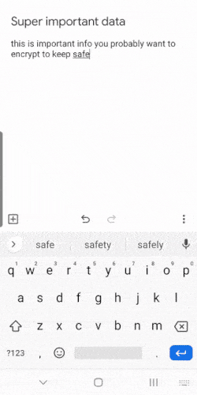

## ProtectoCrypto 

Add an extra layer of protection to your data by password-encrypting it with 256-bit AES security! Check it out in action:

## About

Sometimes you want to make sure particular data on your phone is kept extra safe. Encrypting it with a password only you know is a great way to do that. 

ProtectoCrypto is designed to make it easy and quick to encrypt text data. All you need to do is come up with a password/key. You can then highlight and share your key and data into ProtectoCrypto respectively and they will be ready to go! Then you can encrypt the data and easily copy it for use where you need it. Decrypting your data follows the same flow.

## Android Development Showcase

ProtectoCrypto is developed with some of the most up-to-date Android practices and libraries:

- Hilt dependency injection
- Material Components and theming
- Architecture components
- Coroutines